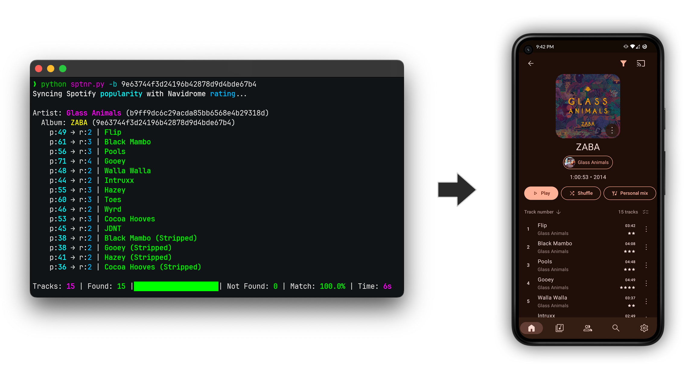

# Spotify Popularity to Navidrome Ratings (sptnr)

This script was developed as a solution to repurpose the star ratings in Navidrome, aligning them with Spotify's track popularity. As a Navidrome user who utilizes the 'favorite' feature instead of star ratings, I wanted to give new life and utility to the unused rating system. By syncing Spotify popularity data with Navidrome's ratings, the script provides a quick way to identify popular tracks. This becomes particularly useful when frequently adding new albums and artists to the Navidrome server, especially those you're not familiar with.



## Features

- **Spotify Integration**: Connects to Spotify's API to fetch popularity data for tracks.
- **Navidrome Integration**: Updates track ratings in Navidrome based on Spotify popularity.
- **Flexible Processing**: Process specific artists, albums, or a range of artists or albums.
- **Preview Mode**: Run the script in preview mode to see changes without making any actual updates.
- **Logging**: Detailed logging of the process, both in the console and to a file.
- **Docker Support**: Run the script in a Docker container for consistent environments and ease of use.

## Requirements

- Python 3.x or Docker
- A Spotify Developer account with an API key ([Get your Spotify API key here](https://developer.spotify.com/dashboard/create))
- Access to a Navidrome server

## Quick Start

You can easily run the script using a pre-built public Docker image. This method is straightforward and does not require building the Docker image locally. You can use the following Docker command and replace the environment variable values with your own:

```console
docker run -t \
  -e NAV_BASE_URL=your_navidrome_server_url \
  -e NAV_USER=your_navidrome_username \
  -e NAV_PASS=your_navidrome_password \
  -e SPOTIFY_CLIENT_ID=your_spotify_client_id \
  -e SPOTIFY_CLIENT_SECRET=your_spotify_client_secret \
  krestaino/sptnr:latest
```

**Note**: The `-t` flag is used to allocate a pseudo-terminal which assists in displaying colored and bold text in the terminal output, which this script uses.

### Using Docker Compose

1. **Create `docker-compose.yml` File**: Set up your `docker-compose.yml` file with the following content, replacing the environment variables with your own details:

   ```yaml
   version: "3.8"

   services:
     sptnr:
       container_name: sptnr
       image: krestaino/sptnr:latest
       environment:
         - NAV_BASE_URL=your_navidrome_server_url
         - NAV_USER=your_navidrome_username
         - NAV_PASS=your_navidrome_password
         - SPOTIFY_CLIENT_ID=your_spotify_client_id
         - SPOTIFY_CLIENT_SECRET=your_spotify_client_secret
       volumes:
         - ./logs:/usr/src/app/logs
   ```

2. **Run the Script**: Execute the Docker Compose command to run the script:

   ```console
   docker-compose run sptnr
   ```

## Running Natively or Building Locally

For those who prefer running the script natively using Python or building the Docker image locally, the following steps apply:

### Running Natively (Without Docker)

1. **Clone the Repository**: Clone the repository or download the necessary files (`sptnr.py`, `requirements.txt`, `.env.example`) to your local machine.

2. **Install Python Packages**: Use the `requirements.txt` file to install dependencies:

   ```console
   pip install -r requirements.txt
   ```

3. **Configure Environment Variables**: Rename `.env.example` to `.env` and fill in your details:

   ```console
   mv .env.example .env
   # Edit the .env file with your details
   ```

4. **Run the Script**: Execute the script with Python:

   ```console
   python sptnr.py [options]
   ```

### Building and Running with Docker Locally

1. **Clone the Repository**: Clone the repository or download the necessary files (`sptnr.py`, `requirements.txt`, `Dockerfile`, `docker-compose.yml.example`) to your local machine.

2. **Configure Docker Compose**: Rename and edit your `docker-compose.yml`:

   ```console
   mv docker-compose.yml.example docker-compose.yml
   # Edit the docker-compose.yml file
   ```

3. **Set the Docker Image Source**: Uncomment the line `build: .` in the `docker-compose.yml` file to build a local Docker image.

4. **Build and Run**: Build the Docker image and run the script:

   ```console
   docker-compose build
   docker-compose run sptnr [options]
   ```

## Usage

The script supports various options for flexible usage. Below are examples of how to run the script with different options, using Python, Docker Compose, and Docker Run methods. Replace `[options]` with any of the specified options based on your needs.

### Options

- `-p, --preview`: Execute the script in preview mode (no changes made).
- `-a, --artist ARTIST_ID`: Process a specific artist. Multiple artists can be specified.
- `-b, --album ALBUM_ID`: Process a specific album. Multiple albums can be specified.
- `-s, --start START_INDEX`: Start processing from the artist at the specified index (0-based).
- `-l, --limit LIMIT`: Limit the processing to a specific number of artists from the start index.

### Command Formats

1. **Running Natively (Python)**:

   ```console
   python sptnr.py [options]
   ```

2. **Using Docker Compose**:

   ```console
   docker-compose run sptnr [options]
   ```

3. **Using Docker Run**:
   ```console
   docker run -t [environment variables] krestaino/sptnr:latest [options]
   ```

## Examples

- **Preview Mode**:
  Run the script in preview mode to see changes without making any actual updates.

  - Python: `python sptnr.py -p`
  - Docker Compose: `docker-compose run sptnr -p`
  - Docker Run: `docker run -t [env vars] krestaino/sptnr:latest -p`

- **Process Specific Artist**:
  Process only one artist by specifying their ID.

  - Python: `python sptnr.py -a artist_id`
  - Docker Compose: `docker-compose run sptnr -a artist_id`
  - Docker Run: `docker run -t [env vars] krestaino/sptnr:latest -a artist_id`

- **Process Specific Albums**:
  Process multiple specific albums by specifying their IDs.

  - Python: `python sptnr.py -b album_id1 -b album_id2`
  - Docker Compose: `docker-compose run sptnr -b album_id1 -b album_id2`
  - Docker Run: `docker run -t [env vars] krestaino/sptnr:latest -b album_id1 -b album_id2`

- **Process Range of Artists**:
  Process artists starting from a certain index with a limit.
  - Python: `python sptnr.py -s 10 -l 5`
  - Docker Compose: `docker-compose run sptnr -s 10 -l 5`
  - Docker Run: `docker run -t [env vars] krestaino/sptnr:latest -s 10 -l 5`

## Resuming Interrupted Sessions

In cases where your session gets interrupted - for instance, if your machine goes to sleep, you encounter rate limits from Spotify, or for any other reason that causes the script to not complete - you have the option to resume from where you left off.

To determine the point of interruption, check the log file. The log entry will contain details of the artist it failed on, along with the index in a format similar to: `Artist: ARTIST_NAME (ARTIST_NAVIDROME_ID)[INDEX]`. Here, the index is enclosed in brackets.

When you restart the script, use the `-s INDEX` option, where `INDEX` is the index number from the log. This tells the script to start processing from that specific artist, skipping all previously processed entries.

Example command to continue from a specific point:

- Python: `python sptnr.py -s INDEX`
- Docker Compose: `docker-compose run sptnr -s INDEX`
- Docker Run: `docker run -t [env vars] krestaino/sptnr:latest -s INDEX`

_Note: Replace `[env vars]` with the required environment variable arguments and `INDEX` with the specific index number from your log file._

## Note on Using `docker-compose run`

In this project, `docker-compose run` is used instead of `docker-compose up`. This choice allows for greater flexibility in passing command-line options directly to the script, essential for its varied operational modes.

It's important to understand that `docker-compose run` creates a new container each time it's executed. If you're frequently running the script, you might accumulate a number of these containers. To manage this, you can periodically clean up these containers using the following Docker command. This command is tailored to remove only the containers created by this project:

```console
docker container prune --filter "label=com.docker.compose.project=sptnr"
```

## Mapping Spotify Popularity to Navidrome Ratings

The script translates Spotify's popularity metric, which ranges from 0 to 100, into Navidrome's 5-star rating system. This conversion allows you to quickly gauge a track's popularity on Spotify directly within Navidrome. The mapping is as follows:

- **0 to 16**: Mapped to 0 stars in Navidrome (Not popular)
- **17 to 33**: Mapped to 1 star (Low popularity)
- **34 to 50**: Mapped to 2 stars (Moderately popular)
- **51 to 66**: Mapped to 3 stars (Popular)
- **67 to 83**: Mapped to 4 stars (Very popular)
- **84 to 100**: Mapped to 5 stars (Extremely popular)

## Estimated Processing Times

The script's processing time can vary based on several factors, including network speed and server response times. However, based on data from my own usage, I can provide a rough estimate of how long the script might take for different library sizes. The following table gives an approximate duration for processing libraries of various sizes:

| Library Size (Number of Tracks) | Estimated Processing Time |
| ------------------------------- | ------------------------- |
| 1,000                           | 0h 7m 36s                 |
| 5,000                           | 0h 38m 4s                 |
| 10,000                          | 1h 16m 8s                 |
| 50,000                          | 6h 20m 43s                |
| 100,000                         | 12h 41m 27s               |

These estimates are based on the script's performance with my library of 6,481 tracks, which took approximately 49 minutes and 21 seconds to process. Please note that these times are approximate and actual processing times may vary.

## Importance of Accurate Metadata for Track Lookup

The effectiveness of this script heavily relies on the accuracy of the artist, album, and track titles in your music library. For Spotify to successfully recognize and match songs, these metadata details need to be precise.

I personally recommend using **MusicBrainz** to tag your music library. MusicBrainz is a comprehensive music database that provides reliable and standardized music metadata, which significantly enhances the accuracy of track matching with Spotify.

However, it's important to acknowledge that even with a perfectly tagged MusicBrainz library, discrepancies can still occur between Spotify and MusicBrainz data. This may result in the script missing some songs during the matching process.

To give you an idea of the matching accuracy you can expect, here are some statistics from my own library, which is tagged using MusicBrainz:

- **Total Tracks**: 6,481
- **Tracks Found on Spotify**: 6,390
- **Tracks Not Found**: 91
- **Match Percentage**: 98.6%

## Logs

Logs are stored in the `logs` directory. Each execution creates a new log file with a timestamp.
